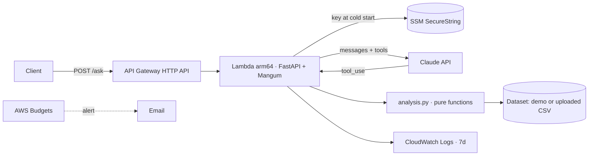

# Spend Agent (FinOps + Personal Finance)

One agent, two everyday jobs: **(1)** read an AWS bill, explain where the money goes, spot anomalies and
estimate savings; **(2)** read a bank statement, find forgotten subscriptions, duplicate charges and
spending habits. Same engine, different tool sets (a `Domain`). Built on Claude with tool use. The model never does the math:
every number comes from a deterministic, unit-tested function.

> AWS: *"Why did our NAT Gateway bill jump?"* · Personal: *"Which subscriptions overlap?"*
>
> Also try: *"Why did our NAT Gateway bill jump?"* · *"What could we save per month in dev?"* ·
> *"Did anything weird happen to our bill recently?"*

## Why it is built this way

| Decision | Reason |
|---|---|
| **LLM explains, code computes** | Totals, rankings and savings come from pure functions (`analysis.py`) with tests. The prompt forbids mental arithmetic. |
| **Manual tool-use loop** | Hard cap on steps and on **spend per request**; the Anthropic client is injectable so the agent loop is tested without network. |
| **`strict: true` tool schemas** | Tool inputs are guaranteed to match the schema; no defensive parsing in business code. |
| **Cost is a feature** | Per-request cost is computed and returned; per-IP rate limit; global daily budget; Lambda reserved concurrency; an AWS Budget alert. |
| **Synthetic data + your own CSV** | The public demo never touches a real account. Anyone can upload a Cost Explorer CSV and get answers about *their* bill (it is never stored). |
| **Evals, not vibes** | `evals/run_evals.py` asks real questions and checks the right tool was called and the right number appears; expected values are computed from the same data. |

## Architecture



## Try it without an API key

```bash
pip install -e ".[dev]"
python scripts/offline_demo.py     # http://127.0.0.1:8000 (web UI + API, Claude replaced by a scripted stand-in)
```
The real tools, API guards, CSV upload and UI all run; only the language model is simulated.

## Run it locally (real Claude)

```bash
python -m venv .venv && . .venv/bin/activate
pip install -e ".[dev]"
pytest -q                                  # 41 tests, no network, no API key

export ANTHROPIC_API_KEY=sk-ant-...
python -m finops_agent "What are my top 3 services this month?" -v
python -m finops_agent --mode finance "Which subscriptions overlap?" -v
python -m finops_agent "Where can I save money?" --csv my_cost_explorer.csv -v

uvicorn finops_agent.api:app --reload      # POST http://localhost:8000/ask
python evals/run_evals.py --max 3          # cheap smoke eval (spends cents)
```

### Using your own data
**Personal finance:** a bank-statement CSV with `Date`, `Description`, `Amount` (negative = expense).
Brazilian format (`dd/mm/yyyy`, `1.234,56`, `;` separator) works. The raw statement never reaches the model:
Claude only sees compact tool results.

**AWS:** Export from **AWS Cost Explorer → Download CSV** (daily, grouped by Service), or any CSV with
columns `Date, Service, Cost`. Wide format (a `Service` column followed by ISO-date columns) also works.
Without a resource inventory the agent answers cost questions but says clearly that it cannot
detect idle resources.

## Deploy (≈ $0/month on AWS)

```bash
./scripts_package.sh                       # lambda.zip with Linux/arm64 wheels
cd infra
terraform init
terraform apply -var anthropic_api_key=sk-ant-... -var alert_email=you@example.com
```

Free-tier shape: one Lambda (arm64, 512 MB), HTTP API, 7-day logs, no NAT, no database.
The only real cost is the Claude API, bounded by `daily_budget_usd` (default $3) and the
per-request cap. Use `-var model=claude-haiku-4-5` to make the demo very cheap.

## Model and cost notes
- Default model `claude-haiku-4-5` (cheapest Claude, about a cent per question). Override with `FINOPS_MODEL`
  (e.g. `claude-opus-5-5`) and `FINOPS_EFFORT` (sent only to models that support it).
- Typical question: 2 to 3 steps, a few thousand tokens. The exact cost is in every API response.
- Pricing table lives in `agent.py` (`PRICING`); update it with the provider's pricing page.

## Repo map
```
src/finops_agent/   data.py + analysis.py (AWS domain) · finance.py (personal-finance domain)
                    agent.py (loop, Domain registry) · api.py (FastAPI, guards, serves index.html)
                    index.html (web UI) · lambda_entry.py · __main__.py (CLI)
scripts/            offline_demo.py (full app without an API key)
tests/              analysis, agent loop (fake client), API guards
evals/              11 live golden-set cases (7 AWS, 4 personal finance), expectations computed from the data
infra/              Terraform: Lambda, API Gateway, SSM, Budgets
.github/workflows/  lint, tests, terraform validate, optional live evals
```

## Limits (honest list)
- Savings are estimates from documented assumptions (`SAVINGS_RATE` in `analysis.py`), not guarantees.
- The demo inventory is synthetic. Real inventory support (Cost Explorer API / resource scans) is the next step.
- In-memory rate limit and budget are per Lambda instance; for strict global limits use DynamoDB.
